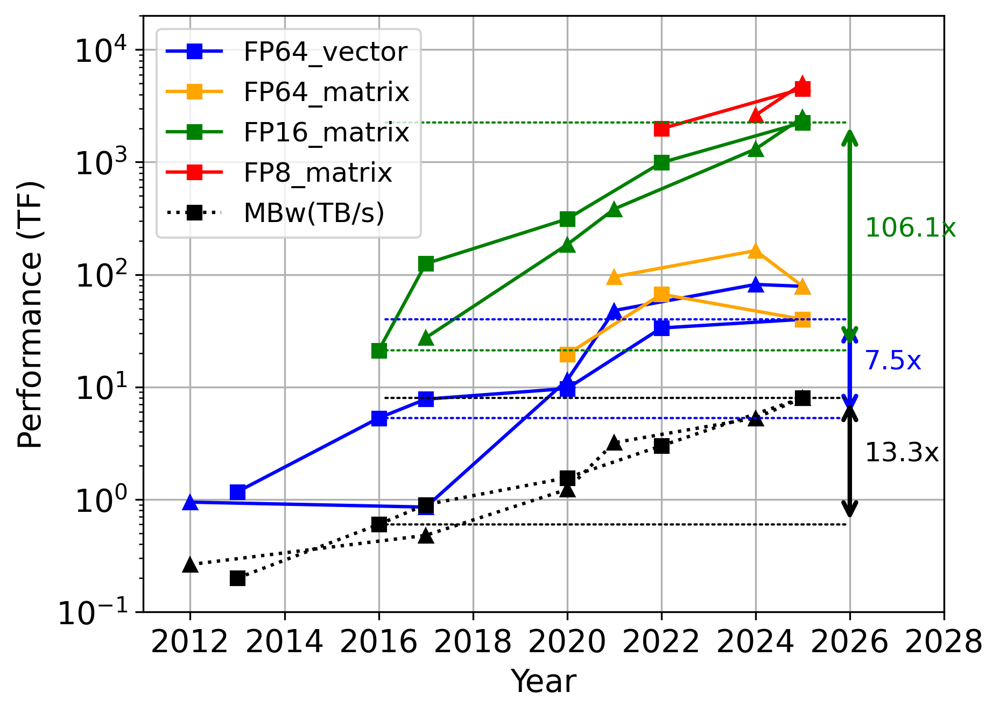

# First Workshop on Mixed- and Adaptive-Precision Numerics for Scientific Computing (MxP4S)

[Dates](dates.md) | [Speakers](speakers.md) | [Format of the workshop](format.md) | [Organizers](orgranizers.md)

Thank you for your interest in the MxP4S workshop! This is a half-day workshop at the 40th IEEE International Parallel & Distributed Processing Symposium, [IPDPS 2026](https://www.ipdps.org/). This first iteration of the workshop will consist of invited talks from several distinguished researchers and practitioners. If you are interested in numerical methods, simulations and/or high performance computing, please attend and participate in the audience discussions!

New and upcoming HPC platforms are incorporating disproportionately large capacity for low-precision arithmetic, while their double-precision throughput is increasing slowly or even plateauing. This is largely driven by the needs of artificial intelligence (AI) model training and inference, mostly by large software companies. Meanwhile, the computing resource needs of computational science continue to rise unabated. For many scientific domains, the high levels of low-precision throughput on modern hardware is not directly usable because of accuracy or stability requirements of first-principles simulations. There are even several types of data-driven methods in scientific studies that do not use neural networks nor gradient descent, and thus do not automatically benefit from low-precision compute throughput. Thus, it is of great interest to formulate guidelines for how computational scientists in different domains should utilize low-precision capabilities of modern hardware, while understanding the impact on applications’ accuracy. This is highly important for time to solution, storage footprint, and energy efficiency of scientific software, as well as the productivity and running costs of HPC facilities.

We also have an opportunity to redefine precision in scientific computing in terms of adaptive precision rather than one or two fixed precision formats. This will lead to a sustainable paradigm that achieves the best performance while obtaining reliable results on current and upcoming hardware architectures. What this paradigm looks like and how it incorporates different computational motifs and application domains are important questions.
